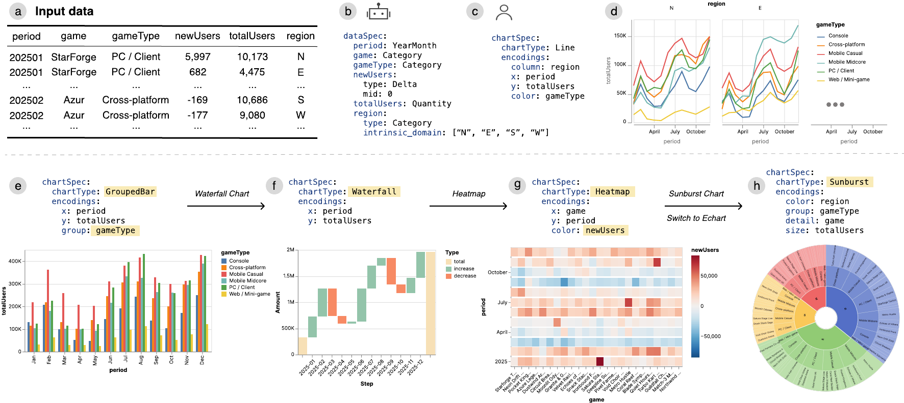

# Flint: A Visualization Language for the AI Era

[](#install)
[](#python-planned)
[](https://www.npmjs.com/package/flint-chart)
[](https://github.com/microsoft/flint-chart/actions/workflows/ci.yml)
[](LICENSE)

[](https://microsoft.github.io/flint-chart/)
[](agent-skills/flint-chart-author/SKILL.md)

Flint is a visualization intermediate language that lets **AI agents create
expressive, polished visualizations from simple, human-editable chart specs**.
Instead of asking agents or developers to tune verbose low-level parameters such
as scales, axes, spacing, and layout, the Flint compiler derives optimized chart
settings from the data, semantic types, chart type, and encodings. The result is
a compact chart specification that agents can produce reliably, people can edit
directly, and multiple backends can render: **Vega-Lite, ECharts, and Chart.js**.

<p align="center">
  
</p>

## Features

- **Specify with semantic types.** Flint captures what each field *means* using 70+ fine-grained semantic types (e.g., `Rank`, `Temperature`, or `Delta`).
  They guide parsing, scales, axes, formatting, and color decisions.
- **Optimize layout automatically.** Flint adapts sizing, spacing, and mark
  arrangement to the data cardinality, chart design, and canvas constraints
  using an elastic layout model.
- **Generate simple editable specs.** Flint specs are short enough for agents
  to write reliably and clear enough for people to refine by hand. Switch chart
  types or rebind encodings, and the compiler cascades the change. The
  [agent skill](agent-skills/flint-chart-author/SKILL.md) gives agents a concrete
  authoring contract for reliable, polished charts.
- **Render across multiple backends.** Compile one spec through a unified
  interface to **30+ chart types** across **Vega-Lite, ECharts, and Chart.js**.

<br/>

<p align="center">
  
</p>
<p align="left"><sub>Flint compiles high-level data and chart specs into optimized visualizations. Because the compiler manages low-level design details, users can move from a faceted line chart to a grouped bar, waterfall, heatmap, or sunburst, or switch rendering engines without rewriting the spec.</sub></p>


## Install

```bash
# JavaScript / TypeScript  (npm package: flint-chart)
npm install flint-chart

# MCP server for agents  (npm package: flint-chart-mcp)
npx -y flint-chart-mcp
```

### Python planned

The Python port is currently a source-only preview in this repo. PyPI publishing
is planned for a later release and is skipped for the first public launch while
the compatibility suite is being stabilized.

## Setup for Agent workflows

Flint gives agents a small chart contract: the agent generates a `chart_spec`
and `semantic_types`, and Flint compiles that spec into Vega-Lite, ECharts,
Chart.js, PNG, or SVG output.

Use the setup that matches your environment:

- **Coding agents and IDEs:** ask Copilot, Cursor, Claude Code, or another
  coding agent to read [`agent-skills/flint-chart-author/SKILL.md`](agent-skills/flint-chart-author/SKILL.md),
  then add a Flint chart to your app, notebook, or script. Generated code can
  bind runtime variables such as `rows` directly.
- **Chat products with tool support:** connect the
  [`flint-chart-mcp`](packages/flint-mcp/README.md) server, pass the user's data
  context to the agent, and have the client load `flint://agent-skill` or the
  `author_flint_chart` prompt before asking it to render or compile a chart.
  MCP calls can embed rows or reference local data files under configured data roots.
- **Plain chat or model APIs:** include the Flint skill instructions in the
  prompt and ask the model for a Flint spec. Compile the result later with
  `flint-chart` or the MCP server.

The agent skill contains the chart-type catalog, channel rules, and worked
examples that keep generated specs consistent.

### MCP server

For agents that speak the **Model Context Protocol**, the
[`flint-chart-mcp`](packages/flint-mcp/README.md) server turns a spec into a
rendered PNG or SVG — `data + spec → image` — entirely in-process, with no data
upload. It also exposes the bundled authoring skill as `flint://agent-skill`
and an `author_flint_chart` prompt, so the agent can load the chart-spec rules
before calling the tools. Add it to any MCP client (Claude Desktop, Cursor, VS Code):

```json
{ "mcpServers": { "flint": { "command": "npx", "args": ["-y", "flint-chart-mcp"] } } }
```

It exposes five Flint-focused tools: `create_chart_view`, `render_chart`,
`compile_chart`, `validate_chart`, and `list_chart_types`. Direct MCP rendering
accepts embedded `data.values`. To render local JSON/CSV/TSV files by
`data.url`, start the server with allowed data roots such as `--data-roots
./data` or `FLINT_MCP_DATA_ROOTS=./data`.

## Use the API

Every backend accepts the **same** `ChartAssemblyInput` and returns the target
library's native spec object.

### JavaScript / TypeScript

```ts
import { assembleVegaLite } from 'flint-chart';

const spec = assembleVegaLite({
  data: { values: myData },
  semantic_types: { weight: 'Quantity', mpg: 'Quantity', origin: 'Country' },
  chart_spec: {
    chartType: 'Scatter Plot',
    encodings: { x: { field: 'weight' }, y: { field: 'mpg' }, color: { field: 'origin' } },
    baseSize: { width: 400, height: 300 },
  },
});
// → a ready-to-render Vega-Lite spec
```

Swap the backend without changing the input shape:

```ts
import { assembleECharts, assembleChartjs } from 'flint-chart';

const option = assembleECharts({
  data: { values: myData },
  semantic_types: { weight: 'Quantity', mpg: 'Quantity' },
  chart_spec: { chartType: 'Scatter Plot', encodings: { x: { field: 'weight' }, y: { field: 'mpg' } } },
});

const config = assembleChartjs({
  data: { values: myData },
  semantic_types: { category: 'CategoryCode', value: 'Quantity' },
  chart_spec: { chartType: 'Bar Chart', encodings: { x: { field: 'category' }, y: { field: 'value' } } },
});
```

### Python planned

Python support will use the same `ChartAssemblyInput` shape. The package and
usage docs will be published with a later PyPI release.

### The chart spec

```ts
interface ChartAssemblyInput {
  data: { values: any[] } | { url: string };   // inline rows or a JSON/CSV URL
  semantic_types?: Record<string, string>;      // field -> semantic type
  chart_spec: {
    chartType: string;                          // e.g. "Scatter Plot"
    encodings: Record<string, ChartEncoding>;   // channel -> encoding
    baseSize?: { width: number; height: number };   // target layout size, default 400x320
    canvasSize?: { width: number; height: number }; // optional maximum rendered size
    chartProperties?: Record<string, any>;      // per-chart tuning (optional)
  };
  options?: AssembleOptions;                     // advanced assembly options (rarely needed)
}
```

| Key | What it is |
|-----|------------|
| `data` | `{ values: [...] }` (inline rows) or `{ url: "..." }` (host-resolved JSON/CSV reference) |
| `semantic_types` | Per-field meaning, e.g. `{ revenue: "Price", country: "Country" }` — drives all derived config |
| `chart_spec` | What to draw: chart type, channel→field encodings, base/canvas size, properties |
| `options` | Advanced layout and tooltip options |

Most users can omit sizing entirely or set `baseSize` for the intended chart
size. Use `canvasSize` when the chart must fit a fixed slot. Flint handles dense
data and labels automatically; see [Example: Auto Layout](docs/tutorials/chart-sizing.md)
and [Auto Layout Algorithm](docs/design-stretch-model.md) for details.

Semantic types cover temporal (`DateTime`, `Year`, `Month`), measures (`Quantity`,
`Price`, `Percentage`), discrete numerics (`Rank`, `Score`, `ID`), geographic
(`Latitude`, `Country`, `City`), categorical (`PersonName`, `Status`, `Boolean`),
ranges (`AgeGroup`, `Bucket`), and fallbacks (`String`, `Number`, `Unknown`). See
the [API reference](docs/api-reference.md) for the full list, the template
registries, and core utilities.

## Repository overview

```
flint-chart/
├── packages/
│   ├── flint-js/          npm package `flint-chart` (TypeScript)
│   │   └── src/
│   │       ├── core/      semantics, layout, decisions, shared types
│   │       ├── vegalite/  Vega-Lite backend
│   │       ├── echarts/   ECharts backend
│   │       ├── chartjs/   Chart.js backend
│   │       └── test-data/ fixtures + generators (drive tests and the gallery)
│   ├── flint-py/          Python port preview (PyPI package planned later)
│   └── flint-mcp/         npm package `flint-chart-mcp` (MCP render server)
├── site/                  Vite + React demo: landing, gallery, editor, docs
├── agent-skills/          AI agent skill (SKILL.md)
├── shared/test-data/      JSON fixtures shared across JS + Python
└── docs/                  architecture and design documents
```

### Documentation

| Topic | Where |
|-------|-------|
| Overview & concepts | [docs/overview.md](docs/overview.md) · [live docs](https://microsoft.github.io/flint-chart/#/documentation/overview) |
| Architecture | [docs/architecture.md](docs/architecture.md) |
| Semantic-type design | [docs/design-semantics.md](docs/design-semantics.md) |
| Auto Layout Algorithm | [docs/design-stretch-model.md](docs/design-stretch-model.md) |
| Color decisions | [docs/color-decisions.md](docs/color-decisions.md) |
| API reference | [docs/api-reference.md](docs/api-reference.md) |
| Extending Flint | [Extending chart templates](docs/adding-a-chart-template.md) · [Extending semantic types](docs/adding-a-semantic-type.md) · [Extending backends](docs/adding-a-backend.md) |
| For AI agents | [agent-skills/flint-chart-author/SKILL.md](agent-skills/flint-chart-author/SKILL.md) |

---

## Contributing

Contributions are welcome! See [.github/CONTRIBUTING.md](.github/CONTRIBUTING.md)
and the [Development guide](docs/DEVELOPMENT.md).

```bash
git clone https://github.com/microsoft/flint-chart
cd flint-chart
npm install            # root workspaces: packages/flint-js + flint-mcp + site

npm run typecheck      # typecheck packages/flint-js + packages/flint-mcp
npm run test           # Vitest (packages/flint-js + packages/flint-mcp)
npm run build          # build packages/flint-js + packages/flint-mcp
npm run site           # demo site (gallery + editor) at http://localhost:5274/
```

Node 18+ is required. The demo site aliases `flint-chart` to
`packages/flint-js/src`, so library edits hot-reload in the gallery and editor
without rebuilding `dist/`.

Quick recipes: [Extending chart templates](docs/adding-a-chart-template.md) ·
[Extending semantic types](docs/adding-a-semantic-type.md) ·
[Extending backends](docs/adding-a-backend.md). Please run
`npm run typecheck && npm run test && npm run lint` before opening a PR.

This project has adopted the
[Microsoft Open Source Code of Conduct](.github/CODE_OF_CONDUCT.md). See
[SECURITY.md](.github/SECURITY.md) to report vulnerabilities.

## Trademarks

This project may contain trademarks or logos for projects, products, or services.
Authorized use of Microsoft trademarks or logos is subject to and must follow
[Microsoft's Trademark & Brand Guidelines](https://www.microsoft.com/en-us/legal/intellectualproperty/trademarks/usage/general).
Use of Microsoft trademarks or logos in modified versions of this project must not
cause confusion or imply Microsoft sponsorship. Any use of third-party trademarks
or logos is subject to those third parties' policies.

## License

[MIT](LICENSE) © Microsoft Corporation
