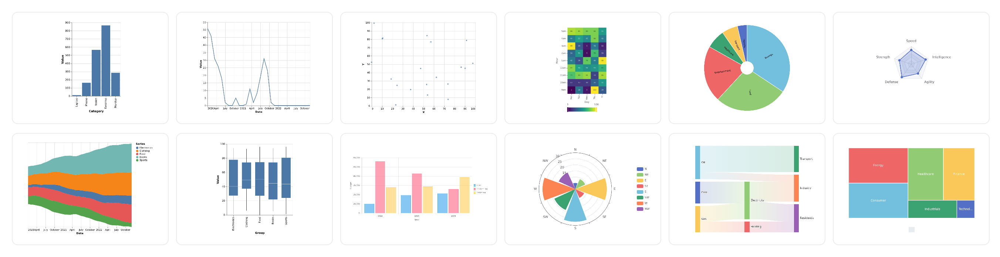
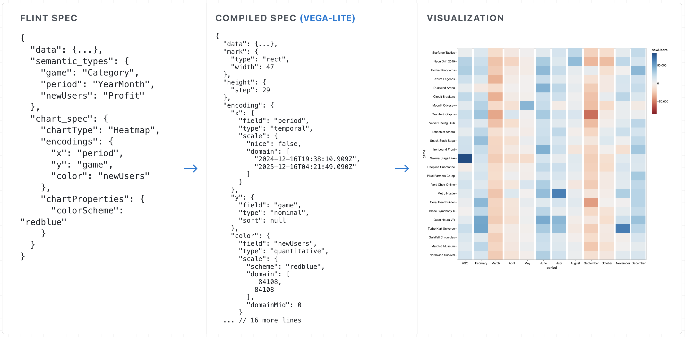
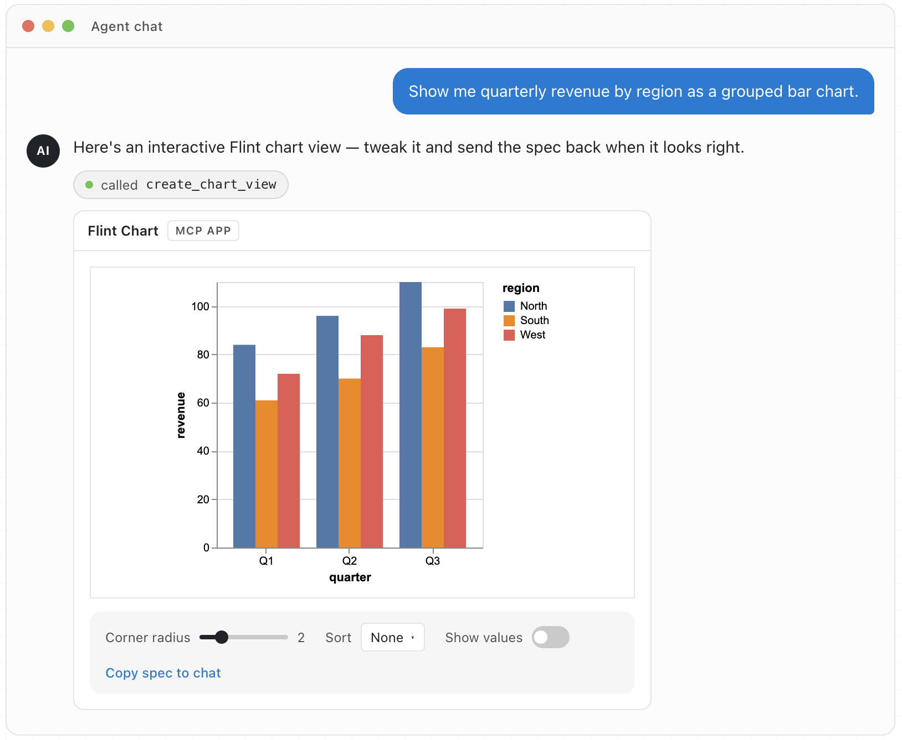

# Flint: A Visualization Language for the AI Era

[](https://www.npmjs.com/package/flint-chart)
[](https://www.npmjs.com/package/flint-chart-mcp)
[](https://github.com/microsoft/flint-chart/actions/workflows/ci.yml)
[](LICENSE)

**Please visit:** [**Flint Project Site**](https://microsoft.github.io/flint-chart/) | [**MCP Server Guide**](https://microsoft.github.io/flint-chart/#/mcp)

Flint is a visualization intermediate language that lets **AI agents create
expressive, polished visualizations from simple, human-editable chart specs**.
Instead of asking agents or developers to tune verbose chart configuration
details such as scales, axes, spacing, labels, and layout, the Flint compiler
derives optimized chart settings from the data, semantic types, chart type, and
encodings. The result is a compact chart specification that agents can produce
reliably, people can edit directly, and multiple backends can render as native
[Vega-Lite](https://vega.github.io/vega-lite/),
[ECharts](https://echarts.apache.org/), or
[Chart.js](https://www.chartjs.org/) specs.

This repo contains two main components:

- **`flint-chart`**: a JavaScript/TypeScript library that compiles the same
  Flint input into Vega-Lite, ECharts, or Chart.js specs.
- **`flint-chart-mcp`**: an MCP server that lets agents create, validate, and
  render charts directly from a chat or coding environment.

<p align="center">
  
</p>

## Features


- **Semantic chart specs.** Flint captures what each field means using 70+
  semantic types such as `Rank`, `Temperature`, `Price`, or `Country`.
- **Automatic layout.** Flint adapts sizing, spacing, labels, marks, and legends
  to the data cardinality, chart design, and canvas constraints.
- **Multiple backends.** Compile one input to 30+ chart types across
  [Vega-Lite](https://vega.github.io/vega-lite/),
  [ECharts](https://echarts.apache.org/), and
  [Chart.js](https://www.chartjs.org/), with more to come soon.
- **Agent-ready chart authoring.** The MCP server gives agents Flint tools and
  chart guidance so they can choose a template, validate it, and open an
  interactive chart view in MCP-capable clients.


<p align="center">
  
  <br>
  <sub>Flint turns compact chart specs into backend-native specs and rendered visualizations.</sub>
</p>

## Install

```bash
# Use Flint in your JavaScript/TypeScript codebase
npm install flint-chart

# For agents and MCP clients
npx -y flint-chart-mcp
```

<p><sub><span style="color: #6a737d;">Python package: to be released. The current Python port is a source-only preview in this repo.</span></sub></p>

## Use Flint As A Library

Every backend accepts the same `ChartAssemblyInput` and returns the target
library's native spec object.

```ts
import { assembleVegaLite } from 'flint-chart';

const spec = assembleVegaLite({
  data: { values: myData },
  semantic_types: { weight: 'Quantity', mpg: 'Quantity', origin: 'Country' },
  chart_spec: {
    chartType: 'Scatter Plot',
    encodings: { x: { field: 'weight' }, y: { field: 'mpg' }, color: { field: 'origin' } },
    baseSize: { width: 400, height: 300 },
  },
});
// → a ready-to-render Vega-Lite spec
```

Swap the backend without changing the input shape:

```ts
import { assembleECharts, assembleChartjs } from 'flint-chart';

const echartsOption = assembleECharts(input);
const chartjsConfig = assembleChartjs(input);
```

See the [API reference](docs/api-reference.md), [backend references](docs/reference-vegalite.md),
and [live editor](https://microsoft.github.io/flint-chart/#/editor) for more
library examples.

## Use Flint As An MCP Server

Install `flint-chart-mcp` as a [Model Context Protocol](https://modelcontextprotocol.io/)
server when you want an agent to create charts in the same conversation where
the question starts. It can open an interactive chart view, return static
PNG/SVG output, or produce backend-native chart specs.

For setup, start with the
[Flint MCP project page](https://microsoft.github.io/flint-chart/#/mcp). It
includes client configuration, usage examples, and links to deeper references.

<p align="center">
  
</p>

MCP calls let agents embed rows directly as `data.values`, or read configured
local JSON, CSV, or TSV files by `data.url`. For agent workflows without MCP,
use the standalone [agent skill](agent-skills/flint-chart-author/SKILL.md).

## Repository overview

```
flint-chart/
├── packages/
│   ├── flint-js/          npm package `flint-chart` (TypeScript)
│   │   └── src/
│   │       ├── core/      semantics, layout, decisions, shared types
│   │       ├── vegalite/  Vega-Lite backend
│   │       ├── echarts/   ECharts backend
│   │       ├── chartjs/   Chart.js backend
│   │       └── test-data/ fixtures + generators (drive tests and the gallery)
│   ├── flint-py/          Python port preview (package to be released)
│   └── flint-mcp/         npm package `flint-chart-mcp` (MCP render server)
├── site/                  Vite + React demo: landing, gallery, editor, docs
├── agent-skills/          fallback copy of the MCP-served agent skill
├── shared/test-data/      JSON fixtures shared across JS + Python
└── docs/                  architecture and design documents
```

### Documentation

The [project site](https://microsoft.github.io/flint-chart/) is the main entry
point for examples, the live editor, and concept docs. For source-level
references, start with the [API reference](docs/api-reference.md), the
[Flint MCP project page](https://microsoft.github.io/flint-chart/#/mcp), or the
[Development guide](docs/DEVELOPMENT.md).

---

## Contributing

Contributions are welcome! See [.github/CONTRIBUTING.md](.github/CONTRIBUTING.md)
and the [Development guide](docs/DEVELOPMENT.md).

```bash
git clone https://github.com/microsoft/flint-chart
cd flint-chart
npm install            # root workspaces: packages/flint-js + flint-mcp + site

npm run typecheck      # typecheck packages/flint-js + packages/flint-mcp
npm run test           # Vitest (packages/flint-js + packages/flint-mcp)
npm run build          # build packages/flint-js + packages/flint-mcp
npm run site           # demo site (gallery + editor) at http://localhost:5274/
```

Node 18+ is required. The demo site aliases `flint-chart` to
`packages/flint-js/src`, so library edits hot-reload in the gallery and editor
without rebuilding `dist/`.

We especially welcome contributions that add new
[chart templates](docs/adding-a-chart-template.md) or new
[rendering backends](docs/adding-a-backend.md).

This project has adopted the
[Microsoft Open Source Code of Conduct](.github/CODE_OF_CONDUCT.md). See
[SECURITY.md](.github/SECURITY.md) to report vulnerabilities.

## Trademarks

This project may contain trademarks or logos for projects, products, or services.
Authorized use of Microsoft trademarks or logos is subject to and must follow
[Microsoft's Trademark & Brand Guidelines](https://www.microsoft.com/en-us/legal/intellectualproperty/trademarks/usage/general).
Use of Microsoft trademarks or logos in modified versions of this project must not
cause confusion or imply Microsoft sponsorship. Any use of third-party trademarks
or logos is subject to those third parties' policies.

## License

[MIT](LICENSE) © Microsoft Corporation
