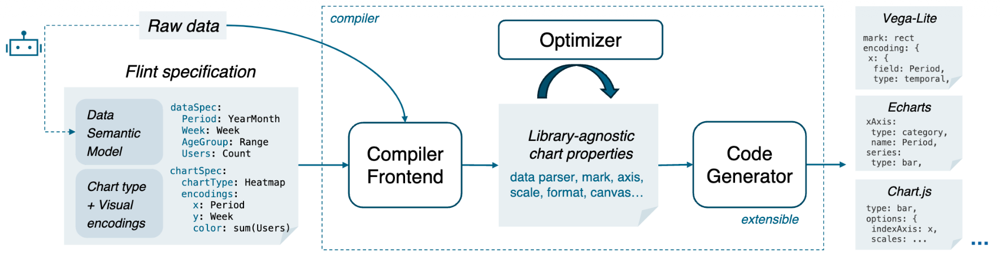

# Overview

**Flint** is a semantic-driven intermediate language (IL) for data visualization. You declare what data *means* and a concise chart intent; the compiler derives scales, axes, aggregation, formatting, layout, and color — then transpiles to Vega-Lite, ECharts, Chart.js, or GoFish.

New users: [Getting started](/tutorials/getting-started) first, then return here for architecture and API depth.

---

## Table of Contents

- [§1 What Flint is](#1-what-flint-is)
- [§2 The problem](#2-the-problem)
- [§3 Flint specification](#3-flint-specification)
- [§4 Compiler output](#4-compiler-output)
- [§5 Architecture at a glance](#5-architecture-at-a-glance)
- [§6 Documentation map](#6-documentation-map)
- [§7 Install and quick start](#7-install-and-quick-start)
- [§8 Tools on this site](#8-tools-on-this-site)
- [§9 Further reading](#9-further-reading)

---

# §1 What Flint is

Flint separates **data semantics** from **chart intent**, similar to how an IL separates program logic from target-machine code ([LLVM](https://llvm.org/) analogy in the paper). Authors avoid hand-tuning interdependent low-level parameters; LLM agents emit compact Flint programs instead of verbose library-native specs that are costly to regenerate and brittle under small edits.

---

# §2 The problem

Declarative grammars (Vega-Lite, ECharts, …) work when primitive types align with visual mappings. They break when **semantic meaning** diverges from storage representation:

- Integer `202001` as **YearMonth**, not a quantitative magnitude
- Stacking non-additive measures (temperature, rates)
- Diverging fields on sequential color ramps

Experts fix this with long, coupled specs; those specs fail when you swap a field, rotate a heatmap, or change chart type. Flint treats **semantic types as first-class objects** and resolves encoding and layout from semantics plus data characteristics.

---

# §3 Flint specification

A Flint program has two reusable parts (paper Fig. 6):

| Paper term | API field | Role |
|------------|-----------|------|
| **dataSpec** | `semantic_types` | Per-field meaning — type string or enriched annotation |
| **chartSpec** | `chart_spec` | Chart type + channel → field bindings |

Raw rows live in `data`. Together they form `ChartAssemblyInput`:

```text
data  +  semantic_types  +  chart_spec  →  assemble*()  →  native spec
```

### dataSpec example

Game-market dataset (paper). Annotations are **inline** in `semantic_types` — there is no separate `semantic_annotations` field:

```json
{
  "semantic_types": {
    "period": "YearMonth",
    "game": "Category",
    "gameType": "Category",
    "newUsers": "PercentageChange",
    "totalUsers": "Quantity",
    "region": {
      "semanticType": "Category",
      "sortOrder": ["N", "E", "S", "W"]
    }
  }
}
```

### chartSpec example

Faceted line chart:

```json
{
  "chart_spec": {
    "chartType": "Line Chart",
    "encodings": {
      "column": { "field": "region" },
      "x": { "field": "period" },
      "y": { "field": "totalUsers" },
      "color": { "field": "gameType" }
    },
    "canvasSize": { "width": 480, "height": 320 }
  }
}
```

**Exploration workflow:** change only `chart_spec` to try heatmap, grouped bar, waterfall, or sunburst — **dataSpec stays fixed**. Switch backend (e.g. Vega-Lite → ECharts) without rewriting the Flint input. See the [gallery](/wall) for template and backend coverage.

Semantic types use a three-level hierarchy (paper L1/L2/L3; code T0/T1/T2). Details: [Semantic types](/documentation/semantic-types).

---

# §4 Compiler output

| Function | Output |
|----------|--------|
| `assembleVegaLite(input)` | Vega-Lite v6 spec |
| `assembleECharts(input)` | ECharts `option` |
| `assembleChartjs(input)` | Chart.js config |
| `assembleGoFish(input)` | GoFish imperative spec |

The same input compiles to every supported backend. Stages 1–2 (semantics + layout) run once in shared `core/`; only Stage 3 (template instantiation) is library-specific.

Full input schema: [API reference](/documentation/api-reference).

---

# §5 Architecture at a glance



| Paper stage | Code | Module |
|-------------|------|--------|
| **Compiler frontend** | Phase 0 — `resolveChannelSemantics()` | `core/resolve-semantics.ts` |
| **Optimizer** | Phase 1 — `computeLayout()`, overflow filter | `core/compute-layout.ts` |
| **Code generator** | Phase 2 — `template.instantiate()` | `vegalite/`, `echarts/`, `chartjs/`, `gofish/` |

1. **Frontend** — encoding type, format, aggregation, scale, domain, color, sort from dataSpec + data
2. **Optimizer** — axis span, band step, facet grid, aspect ratio via physics-based [layout models](/documentation/layout-model)
3. **Code generator** — dynamic templates per `chartType` emit library-native specs

Pipeline detail: [Architecture](/documentation/architecture).

---

# §6 Documentation map

| Section | Pages |
|---------|-------|
| **Introduction** | [Architecture](/documentation/architecture), [API reference](/documentation/api-reference) |
| **Core concepts** | [Semantic types](/documentation/semantic-types), [Layout model](/documentation/layout-model) |
| **Extending** | [Semantic type](/documentation/adding-a-semantic-type), [Backend](/documentation/adding-a-backend), [Template](/documentation/adding-a-chart-template) |
| **Contributing** | [Development](/documentation/development) |

---

# §7 Install and quick start

```bash
npm install flint-chart    # JavaScript / TypeScript
pip install flint          # Python (Vega-Lite today)
```

```ts
import { assembleVegaLite } from 'flint-chart';

const spec = assembleVegaLite({
  data: { values: [{ quarter: 'Q1', revenue: 1200 }] },
  semantic_types: { quarter: 'Quarter', revenue: 'Price' },
  chart_spec: {
    chartType: 'Bar Chart',
    encodings: { x: { field: 'quarter' }, y: { field: 'revenue' } },
    canvasSize: { width: 480, height: 320 },
  },
});
```

---

# §8 Tools on this site

| Page | Use for |
|------|---------|
| [Tutorials](/tutorials/getting-started) | Step-by-step first chart |
| [Gallery](/wall) | Every template + multi-backend preview |
| [Editor](/editor) | Paste JSON, switch Vega-Lite / ECharts / Chart.js |

---

# §9 Further reading

- **Paper:** *Flint: A Semantic-driven Data Visualization Intermediate Language* ([PDF](https://github.com/microsoft/flint-chart/blob/main/docs/figs/AgChart.pdf))
- Agent-oriented design notes: [docs/README.md](https://github.com/microsoft/flint-chart/blob/main/docs/README.md)
