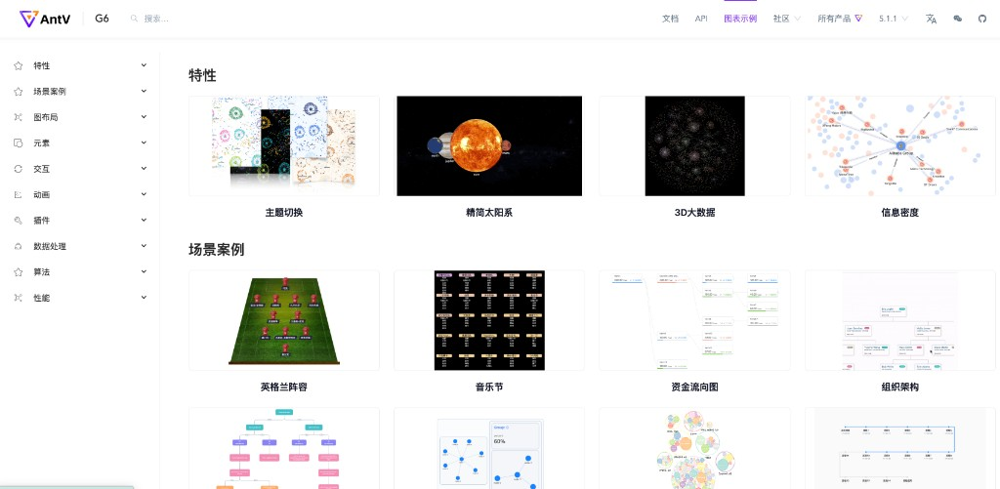
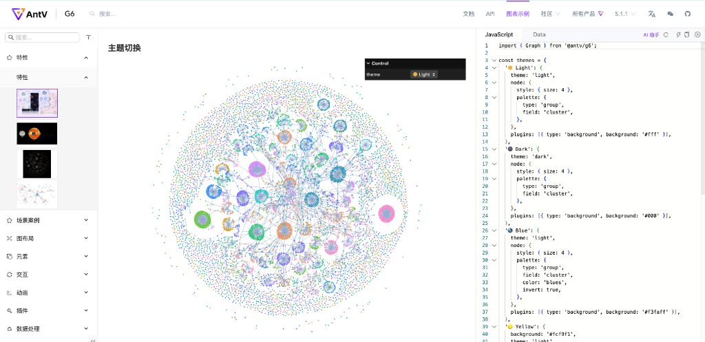
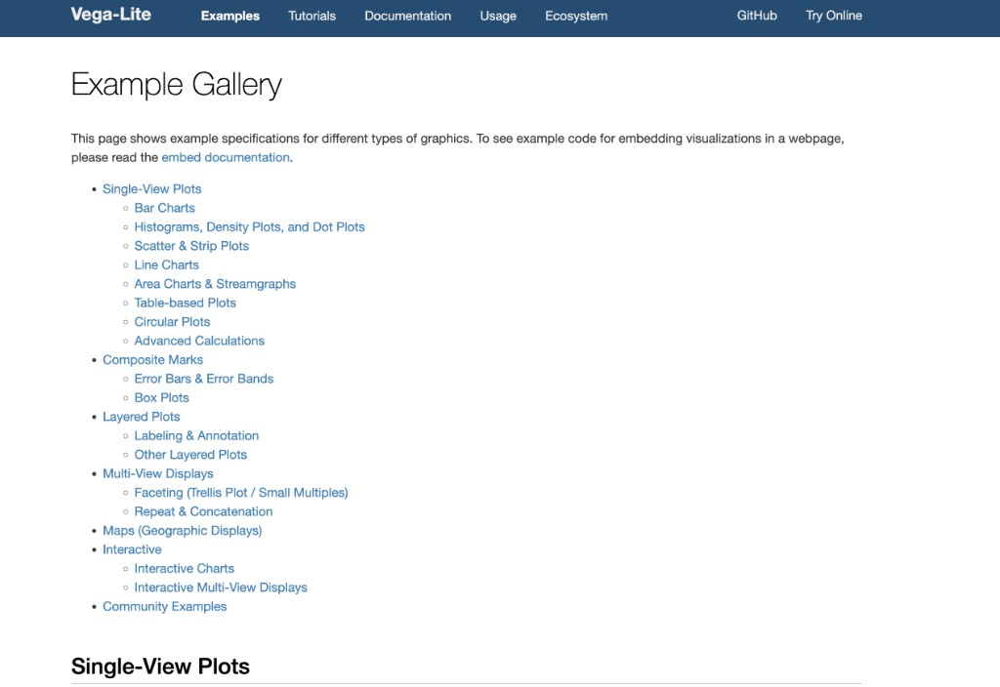
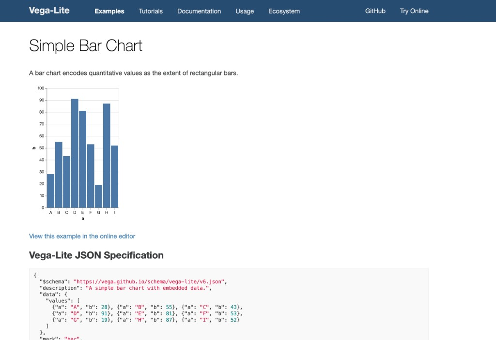
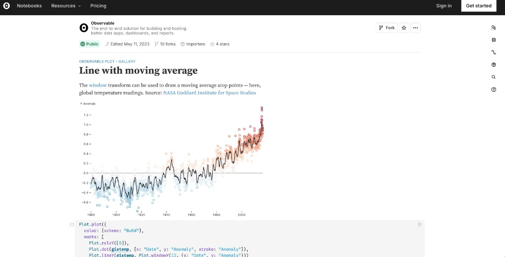
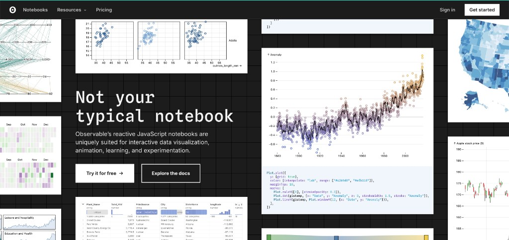
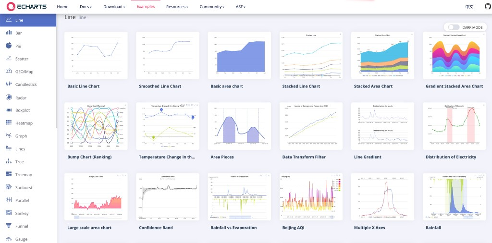
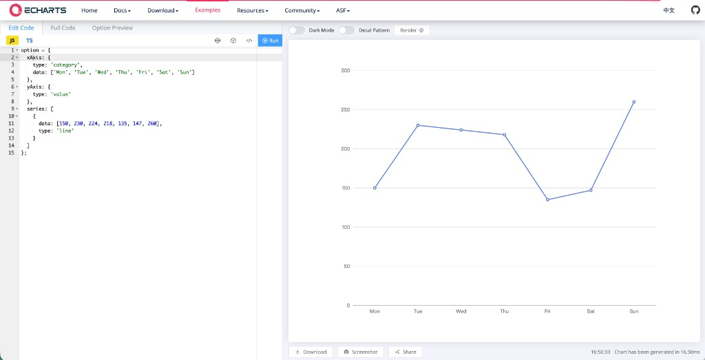

# Flint Chart 官网 / 示例站设计计划（Gallery + Live Editor）

> **状态：** 设计草案（仅规划，未改代码）  
> **日期：** 2026-05-14  
> **范围：** `examples/gallery`、`examples/editor` 的体验与叙事；可选与主文档站或 GitHub Pages 联动  

---

## 1. 产品目标（读者应在短时间内建立何种认知）

1. **Flint 表达意图更短**：输入为「表格数据 + 字段级 `semantic_types` + 高层 `chart_spec`」，由编译器生成各后端的完整图表配置；用户无需从零编写 Vega-Lite 的 `encoding`、`scale`、`axis`、`legend` 等冗长 JSON。
2. **默认可读、观感专业**：Gallery 以**大图、清晰栅格、统一留白**为主，避免多枚小图并列削弱第一印象（与 AntV 示例站强调「开箱观感」的方向一致）。
3. **与「手写 Vega-Lite」对照**：在**同一数据集与相近读图任务**下，用简短文案与（可选）编译产物并排，说明 Flint 如何把版式、格式、色板等决策前移到语义层与推荐逻辑，从而减少 spec 篇幅与决策分支。（Vega-Lite 对部分通道有类型推断与默认样式，但对业务友好的刻度、标签、色盘等，实践中仍常需显式配置；对比时表述应实事求是，见第 9 节。）
4. **Semantic types 有稳定入口**：用侧栏锚点、折叠长文或子路由之一，讲清 T0 / T1 / T2 分层与降级，并链接至 `design-semantics.md` 供深读。

---

## 2. 参考站点调研

下列外链指向各产品官方站点；**截图已放入本仓库** `docs/website-design-assets/`（含 AntV G6、Vega-Lite、Observable、**Apache ECharts**），在 GitHub 或本地 Markdown 预览中应相对于本文路径加载（若 IDE 预览不显示，请确认以仓库根目录打开工作区，并检查 Markdown 预览安全设置）。

### 2.0 AntV G6：图表示例栅格与「示例 + 编辑器」三栏工作台

[G6 图可视化引擎](https://g6.antv.antgroup.com/) 的「图表示例」与单示例页，在信息架构上同时承担 **检索示例** 与 **就地改代码**。

**图 1 — 图表示例首页：左侧分类 + 主区卡片栅格（缩略图 + 标题）**



| 可借鉴点 | 对应本文章节 |
|----------|----------------|
| 侧栏多级分类（特性、场景案例、布局、交互等） | 第 5 节 Gallery、第 7 节导航 |
| 缩略图与短标题、主区分组标题 | 第 5.3 节（主区内视觉层级） |
| 顶栏：文档 / API / 示例 / 社区、搜索 | 第 7 节入口 |

**图 2 — 单示例页：左导航、中大预览、右侧代码（JavaScript / Data 分 Tab）**



| 可借鉴点 | 对应本文章节 |
|----------|----------------|
| 预览占据视觉中心 | 第 4 节 Editor、第 5.3 节 |
| 代码与 **数据** 分 Tab | `data` 与 `semantic_types` 分区展示的参考 |
| 复制、运行、展开等工具条 | 第 8 节 P1 之后可增强 |

**相关官方链接**

- [G6 API · 数据](https://g6.antv.antgroup.com/api/data)（数据模型与 API 目录，可作「数据 / 语义」文档信息架构的参考）
- [G6 官网](https://g6.antv.antgroup.com/)
- [G2 图表示例（英文）](https://g2.antv.antgroup.com/en/examples)（通用统计图示例矩阵）

> 上列截图为 AntV 官方界面，仅作设计与动线参考。

### 2.2 Vega-Lite：Example Gallery 与单示例页（含官方截图）

[Vega-Lite](https://vega.github.io/vega-lite/) 的文档与 [Example Gallery](https://vega.github.io/vega-lite/examples/) 是 Flint 用户最熟悉、也最适合作为 **「手写 spec」对照物** 的参照；[Vega Editor](https://vega.github.io/editor/) 提供在线编辑与分享。

**图 3 — Example Gallery 索引区：以分级列表为主的目录页**



| 观察 | 对 Flint 的启示 |
|------|------------------|
| 类目完整、便于检索（Single-View、Layered、Facet、Interactive 等） | 保留「按场景 / generator 分组」的清晰度 |
| 首屏以文字目录为主，缩略图密度低于 AntV G6 图表示例首页 | Flint Gallery 若以 **缩略图 + 短标题** 为主，更易形成「一眼看到图」的差异 |
| 顶栏含 Documentation、Examples、Try Online 等 | 全局导航与「一键试玩」入口值得对齐 |

**图 4 — 单示例页（Simple Bar Chart）：图 + 说明 + 在线编辑器链接 + JSON 规格**



| 观察 | 对 Flint 的启示 |
|------|------------------|
| 「View this example in the online editor」类链接 | 对应 Flint 第 5.1 / 5.4 节与第 7 节「Gallery → Editor」深链 |
| 即使简单柱状图，spec 仍包含 `$schema`、`data`、`mark`、`encoding` 等完整结构 | 对应第 4 节：在 Editor 中并排展示 **Flint 输入** 与 **编译得到的 Vega-Lite**，用篇幅对比体现「少写」 |
| 默认视觉偏文档演示风格 | Flint 若以默认观感与版式为卖点，需在 Gallery 用真实数据与统一主题证明 |

**相关官方链接**

- [Vega-Lite Example Gallery](https://vega.github.io/vega-lite/examples/)
- [Vega Editor](https://vega.github.io/editor/)
- [Vega-Lite 文档首页](https://vega.github.io/vega-lite/docs/)

**设计取舍（文字摘要）**

- Gallery 可沿用「按图表类型与复合视图能力分块」的思路，但首屏需有一句 **Flint 定位**，避免被误读为普通测试列表。
- Editor 侧可学习 Vega Editor：**错误信息固定区域**、**示例切换不改变整体框架**。
- 后续可在 `website-design-assets/` 增补「同一用例：Flint 输入 vs 生成 VL」的自制对比图，与上列官方截图并列说明。

### 2.3 Observable：首页叙事与 Observable Plot 示例（含官方截图）

[Observable](https://observablehq.com/) 以响应式 Notebook 为核心；[Observable Plot](https://observablehq.com/plot/) 提供声明式 `Plot.plot({...})` API；示例合集以 Notebook 形式发布，例如官方 [Plot Gallery](https://observablehq.com/@observablehq/plot-gallery)，将「结果图 + 简短代码」紧挨展示，与 Flint 希望的「先看到图、再看到多短能写出来」一致。Flint 仍以 **JSON 装配输入 + 多后端编译** 为主，不复制 Notebook 运行时；以下仅借鉴 **版式、首屏叙事与示例节奏**。

**图 5 — Observable Plot Gallery 单例：「Line with moving average」（图在上、代码在下）**



| 观察 | 对 Flint 的启示 |
|------|------------------|
| 面包屑 `OBSERVABLE PLOT > GALLERY`、标题与一段数据来源说明 | Gallery 用例页：**类目路径 + 一句话场景/数据来源**，再进入图与配置 |
| 图下方紧跟短代码（`marks`、`Plot.windowY` 等），左侧有运行/展开类控件 | Editor：**预览与输入同屏**；Flint 若用 JSON，仍可学习「图与配置垂直相邻、减少视线跳跃」 |
| 声明式 API、色板与参考线在少量行内表达 | 与第 1、4 节一致：强调 **意图层压缩**；Flint 用 `semantic_types` + `chart_spec` 而非手写 Plot 或 VL 细节 |

**图 6 — Observable 官网首屏：主文案 + CTA + 图与代码拼贴背景**



| 观察 | 对 Flint 的启示 |
|------|------------------|
| 强主标题与副文案，双按钮（试用 / 读文档） | GitHub Pages 或落地页：**一句定位 + Gallery / Editor / 文档** 主次按钮 |
| 背景拼贴多枚高质量缩略图 | Gallery 或首页：**多图氛围**与单卡大图主预览可结合（注意性能与首屏加载） |
| 中央卡片内「图 + 代码」一体化 | 与图 5 同理：强化「Flint 输入很短、图很清晰」的一体展示（不必采用 Observable 的深色品牌） |

**相关官方链接**

- [Observable 平台](https://observablehq.com/)
- [Observable Plot](https://observablehq.com/plot/)
- [Plot Gallery（Observable Notebook）](https://observablehq.com/@observablehq/plot-gallery)

**设计取舍（文字摘要）**

- **可学**：渐进式教程动线、首屏 CTA、示例页「先图后码」的信息顺序。
- **不必照搬**：完整 Notebook 工作区、Fork/星标社区流、运行时单元格依赖；Flint MVP 保持 **静态示例站 + 本地/单页 Editor** 即可。

### 2.4 Apache ECharts：Examples 画廊与在线编辑器（含官方截图）

[Apache ECharts](https://echarts.apache.org/en/index.html) 的 [Examples（英文索引）](https://echarts.apache.org/examples/en/index.html) 与单例在线编辑器，是 Flint **ECharts 后端**用户已熟悉的「配置项 `option` + 即时预览」范式；与 Vega-Lite 的声明式 spec 不同，ECharts 更偏 **命令式配置对象**，同样适合在 Flint Editor 中作为 **「编译输出对照」** 或「多引擎 Tab」心智参考（本仓库 `assembleECharts` 已存在）。

**图 7 — Examples：侧栏图表族（含图标）+ 主区缩略图栅格（以 Line 类目为例）**



| 观察 | 对 Flint 的启示 |
|------|------------------|
| 侧栏按图表类型分组并配小图标，当前类目高亮 | Gallery：**一眼可扫的分类 + 当前位置**；可与 generator / 场景树结合 |
| 主区多列缩略图 + 短标题，同类目下变体丰富 | 第 5.3 节：主区内 **图优先** 的卡片预览；侧栏「按类型」见第 7 节 |
| 主内容区提供 **Dark mode** 等主题切换 | Flint Gallery / Editor 可提供浅色 / 深色预览，验证默认可读性与导出一致性 |

**图 8 — 单示例在线编辑器：左侧 `option` 代码、右侧实时渲染**



| 观察 | 对 Flint 的启示 |
|------|------------------|
| 经典 **左码右图** 分栏，与 Gallery 点进示例后的工作台一致 | 与第 4、5.4、7 节「Gallery → Editor」及并排对照布局一致，降低学习成本 |
| Tab：Edit Code / Full Code / Option Preview；语言 JS / TS；**Run** 显式触发刷新 | 可学习：**错误与运行反馈**、全量配置与「最小片段」切换；Flint 若以自动编译为主，仍可保留「手动刷新 / 防抖」选项 |
| 基础折线亦需配置 `xAxis`、`yAxis`、`series` 等 | Editor 中展示 **Flint 输入 vs 生成的 ECharts option** 时，可并列说明「意图层」如何展开为轴与系列 |
| 预览区附带下载、截图、分享、渲染耗时等 | 第 8 节 P1 之后可选增强，利于演示与 issue 复现 |

**相关官方链接**

- [Apache ECharts · Examples（英文索引）](https://echarts.apache.org/examples/en/index.html)
- [Apache ECharts 官网](https://echarts.apache.org/en/index.html)
- [Handbook（入门与概念）](https://echarts.apache.org/handbook/en)
- [Option Manual（配置项手册）](https://echarts.apache.org/en/option.html)

**设计取舍（文字摘要）**

- **可学**：图类型侧栏 + 缩略图矩阵、在线编辑器分栏、主题切换与导出类工具。
- **边界**：ECharts 的 `option` 体量与 VL 不同维度的「冗长」；Flint 叙事应对 **各后端编译产物** 分别诚实展示，避免只对比 VL 而忽略 ECharts 用户的体感。

### 2.5 行业常见模式（摘录）

- 示例页提供「在 Playground / Editor 中打开」。
- 深链或查询参数传递示例标识，便于分享与从 Gallery 跳入（注意 URL 长度，见第 9 节）。
- **响应式**：Gallery 可单列堆叠即可；Editor 以桌面宽屏为主，MVP 可明确写清设备优先级。

---

## 3. 与当前仓库实现的关系

- **Gallery**：已有左侧 `TEST_GENERATORS` 键列表、`TripleChart` 三后端并排、`tests.slice(0, 6)` 限制展示条数；源码注释标明仍为 scaffold。**规划变更（见第 7 节）**：左侧改为 **按图表类型** 的侧栏（类 ECharts），主区 **仍保留** 当前「用例标题 + 描述 + `TripleChart`」卡片形态；需在数据层维护 **图表类型 ↔ generator / 用例** 的映射（可从 `chart_spec.chartType`、generator 名规则或单独配置表推导，实现时选定唯一来源）。
- **Editor**：左侧为 `ChartAssemblyInput` 的 JSON（CodeMirror），右侧为后端 Tab（Vega-Lite / ECharts / Chart.js）及可选编译 spec；内置示例见 `examples/editor/src/examples.ts`。
- **语义设计文档**：`docs/design-semantics.md` 描述 T0 / T1 / T2 与降级策略，适合作为站外或 `/docs` 的权威说明；示例站内页以摘要与链接为主，避免重复维护长文。

---

## 4. Live Editor：并排展示「Flint 输入」与「生成的 Vega-Lite」

### 4.1 布局建议（控制复杂度）

在现有「左编辑 / 右预览」基础上，将 **左侧** 拆为 **上下两块**（较左右分栏更不易挤压行宽）：

| 区域 | 内容 |
|------|------|
| **上：Flint 输入** | 可编辑 JSON：`data`、`semantic_types`、`chart_spec`（与当前行为一致） |
| **下：对照** | **只读**、格式化的 **由当前输入编译得到的 Vega-Lite spec**；标题建议写作「Vega-Lite 输出（由 Flint 生成）」，避免被误解为用户手写的最简 spec |

用户心智：**只维护上一份意图描述**；下方为同一意图在当前编译器下的 VL 展开结果，用于感受篇幅与结构复杂度。

**第二阶段可选**

- 低调展示行数或嵌套层级对比。
- 「复制 Vega-Lite」按钮，便于在 Vega Editor 中交叉验证。

### 4.2 错误与空状态

- JSON 语法错误：继续在输入区附近展示解析错误（与现状一致）。
- 编译失败：保留 Flint 输入可编辑；对照区展示失败原因，避免整页空白。

---

## 5. Gallery

### 5.1 布局约束

- **全局**：全站 **顶部导航栏**（类 Vega-Lite：Gallery、Tutorials、Documentation、Usage / Getting started、Ecosystem、GitHub、Try / Editor 等，实现时可按 MVP 裁剪条目）。
- **Gallery 页内**：**左侧** 为 **按图表类型** 分类的侧栏（类 ECharts：类目 + 可选小图标、当前选中高亮）；**右侧主区** **保持与当前 `examples/gallery` 相同** 的用例展示——即每个用例仍以 **标题、描述、`TripleChart`（或等价多后端预览）** 为主的纵向卡片流，**不**把主区改成 ECharts 官网那种纯缩略图矩阵（避免与「和现在 gallery 一样」冲突）。
- **逐例进入 Editor**：在每个用例 **标题同一行末尾** 或 **标题下第一行**，放置与 Vega-Lite 单示例页同款的文案链：**「View this example in the online editor」**（中文站可并列或单独提供「在在线编辑器中打开」）。点击后 **进入当前 Editor 应用界面**（同仓库 `examples/editor`：开发时为另一 Vite 端口或子路径 `/editor`，上线时为统一域名下的 Editor 路由），并载入该用例对应的 `ChartAssemblyInput`（载荷方式见 §5.4）。

### 5.2 视觉层级（主区内）

- **主预览**：默认突出单一后端（例如 Vega-Lite）或 Flint 首推导出效果；ECharts、Chart.js 作为 Tab 或次级折叠，避免三列长期同权导致「测试页」观感。
- **多引擎**：以「另存为其他引擎」或「多引擎」Tab 呈现，强调能力边界而非首屏噪音。

---

## 6. Semantic types：放置位置与内容边界

### 6.1 放置方案比较

| 方案 | 优点 | 缺点 |
|------|------|------|
| **A.** Gallery 页侧栏 **图表类型区下方** 或主区顶部固定「Semantic types」入口 + 页内长折叠 | 曝光高；与第 7 节侧栏并存时需控制高度（可折叠「高级 / 语义」区） | 侧栏信息密度上升 |
| **B.** 独立路由（如 `/semantic-types`） | 内容易扩展 | 多一页导航与构建配置；需放入顶栏 **Documentation** 子链或主导航 |
| **C.** 仅链至 `docs/design-semantics.md` | 维护单点 | 离开示例站语境 |

**MVP 建议：** **A**（与图表类型侧栏分区排版）；内容膨胀后再引入 **B**，并在顶栏 **Documentation** 中链入。

### 6.2 示例站页内大纲（精简）

1. 一句话：字段语义类型如何影响格式、聚合、基线、色板类别等默认决策。  
2. T0 / T1 / T2：由粗到细，**缺失细粒度类型时降级而非失败**。  
3. 一至两个静态对照（如仅标为数值与标注为 `Amount` / `Proportion` 时的轴与标签差异）。  
4. 指向 `design-semantics.md` 全文。

---

## 7. 信息架构：顶栏（类 Vega-Lite）+ Gallery（侧栏类 ECharts、主区保持现状）

### 7.1 全站顶部导航栏

对齐 [Vega-Lite 文档站](https://vega.github.io/vega-lite/) 顶栏信息结构（不必逐项同名，但类目宜接近用户心智）：

| 导航项 | 用途（建议） |
|--------|----------------|
| **Gallery**（或 **Examples**） | 进入示例画廊（本页为站内核心流量入口之一）。 |
| **Tutorials** | 分步入门、常见数据集走通；MVP 可单页或外链。 |
| **Documentation** | API / 装配输入 schema / 链至仓库 `docs/` 与 `design-semantics.md`。 |
| **Usage**（或 **Getting started**） | 安装、一行代码渲染、与框架集成要点。 |
| **Ecosystem** | 相关工具、后端矩阵、Roadmap；可精简为单页。 |
| **GitHub** | 源码仓库。 |
| **Try online** / **Editor** | **直达** 在线 **Editor** 根路由（空白或默认模板）；与 Gallery 内 **「View this example in the online editor」**（带用例上下文）区分。 |

可选：**搜索**、**中 / 英文**（非 MVP 可后做）。

### 7.2 Gallery 页：侧栏 + 主区

```
Gallery 路由（/ 或 /gallery）
├── 顶栏（见 §7.1，全站一致）
├── 左侧边栏
│   ├── 按「图表类型」分组（参考 ECharts Examples：Line、Bar、Scatter…；类目映射见第 3 节）
│   └── [可选] Semantic types 入口（见第 6 节）
└── 主内容区（与当前实现一致）
    └── 当前选中类型下的用例列表：标题 + 描述 + TripleChart（或等价）
        └── 每例标题旁：「View this example in the online editor」→ Editor + 该例载荷
```

- **侧栏**：负责 **「按图表类型找例」**；可保留图标、选中态、与 ECharts 类似的纵向类目列表。  
- **主区**：**不改为**缩略图-only 的矩阵；延续 **大卡片 + 多后端预览**，以满足「图表展示还是和现在 gallery 一样」的产品要求。  
- **逐例链接**：文案 **「View this example in the online editor」** 与 Vega-Lite 单例页一致，便于用户迁移习惯；点击跳转 **现有 Editor 界面**（见 §5.4）。

### 7.3 Editor 路由（建议）

```
/editor（或独立子应用 + 统一域名）
├── Flint 输入（JSON）
├── 生成的 Vega-Lite（只读对照，见第 4 节）
└── 预览（主后端 + 多引擎 Tab）
```

- 从 **顶栏 Try / Editor** 进入：无 `generator` / `case` 参数时加载默认空模板或内置第一个示例。  
- 从 **Gallery 逐例链接** 进入：携带 §5.4 约定参数，自动填充该用例 `ChartAssemblyInput`。

### 7.4 落地页与仓库入口

- 对外首页或 GitHub Pages：**一句定位 + 顶栏或首屏 CTA** 指向 **Gallery** 与 **Editor**；与 Observable 式双按钮可并存，但 **全局顶栏** 为信息架构主轴。

---

## 8. 分阶段交付

| 阶段 | 交付内容 | 验收要点 |
|------|----------|----------|
| **P0** | Editor 左栏：Flint 输入 + 只读生成 VL；Gallery 顶部对比折叠带 | 新用户能在约半分钟内理解「维护单份输入」 |
| **P1** | 全站 **顶栏**（Gallery / Tutorials / Documentation / …）；Gallery **按图表类型侧栏**；主区保持现有卡片 + `TripleChart`；每例标题处 **「View this example in the online editor」** 深链至 Editor 且可复现该例 | 任意展示用例一键进入 Editor 且状态一致 |
| **P2** | Gallery 主图 + 多引擎 Tab；精选用例的补充说明 | 整体更接近产品站而非内部测试列表 |
| **P3** | Semantic types 独立短页或小册式滚动区 + 图示 | 清楚区分「统计类型 Q/N/O/T」与 Flint「业务语义类型」的角色 |

---

## 9. 风险与表述原则

- **载荷与隐私**：大 JSON 避免直接塞进 URL；可用 `sessionStorage` 或短键服务端交换（若未来有后端）。
- **对比诚实性**：对照区展示 **当前版本编译器真实输出**；不虚构「手写 VL 最少行数」。Vega-Lite 具备强表达力与部分默认行为，叙事重点放在 **意图层压缩与默认决策外置**，而非贬低 VL。
- **维护成本**：卡片文案以模板与数据驱动为主，少量手写「标杆用例」即可。

---

## 10. 实现阶段可执行项（备忘）

1. `examples/editor`：基于已有 `assembleVegaLite` 结果序列化至只读面板；解析 URL 查询参数或 `sessionStorage` token，**预填**来自 Gallery 的 `ChartAssemblyInput`。  
2. `examples/gallery`：增加 **全站顶栏** 组件；左侧 **图表类型** 侧栏（数据源：类型 ↔ generator/用例映射）；主区沿用现有卡片结构；每例标题行渲染 **「View this example in the online editor」** 并指向 Editor（开发环境需处理跨端口 URL 或反向代理为同域）。  
3. `examples/gallery` 与 `examples/editor`：抽取共享的注册表与「打开 Editor」载荷编码（可考虑 `examples/shared` 等小模块）。  
4. 样式：提取有限 CSS 变量（背景、边框、主色），与 `docs/landing.html` 等品牌触点可选对齐。

---

**文档性质：** 设计与调研归档；实施顺序以第 8 节为准，**本文不替代** `design-semantics.md` 中的语义类型技术定义。
